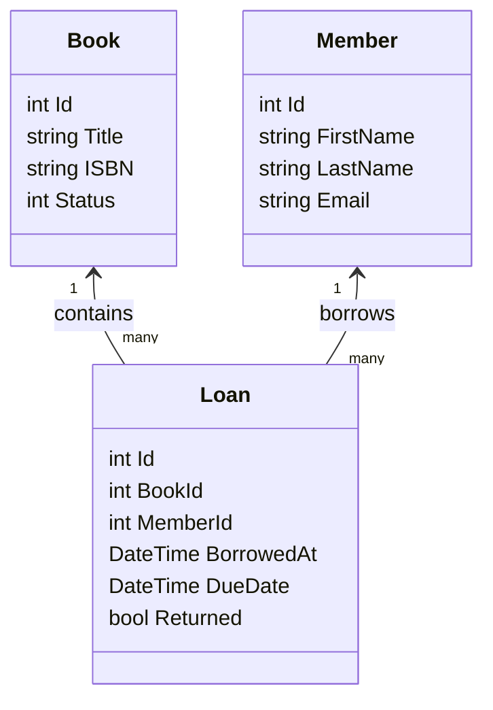
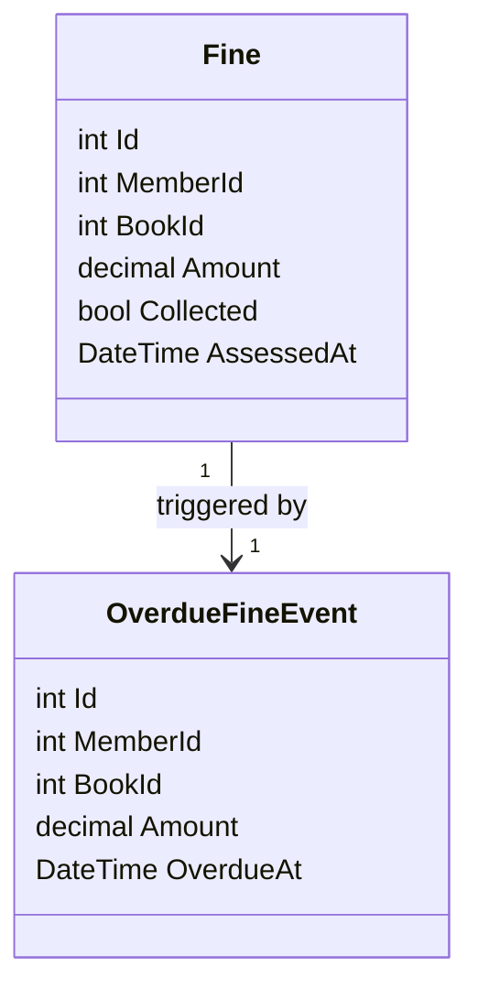
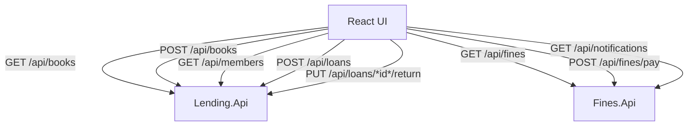
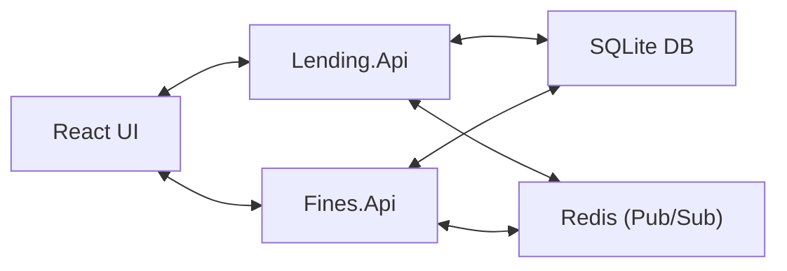

# Library Management System

A full-stack solution for managing library book lending and fines, built with ASP.NET Core (.NET 8), React + TypeScript (Vite), and SQLite. The system is composed of three main projects:

- **Lending.Api**: Manages books, members, and loan operations.
- **Fines.Api**: Handles overdue fines and notifications.
- **React UI**: Modern frontend for users and staff.

---

## Table of Contents

- [Architecture](#architecture)
- [Features](#features)
- [Project Structure](#project-structure)
- [Getting Started](#getting-started)
- [API Endpoints](#api-endpoints)
- [Development Notes](#development-notes)
- [License](#license)
- [Credits](#credits)

---

## Architecture

- **Backend**: Two ASP.NET Core Web APIs (`Lending.Api`, `Fines.Api`) using Entity Framework Core with SQLite.
- **Frontend**: React + TypeScript app powered by Vite.
- **Inter-service Communication**: Redis is used for pub/sub notifications between APIs.
- **Containerization**: All services are orchestrated with Docker Compose for easy startup and integration.
 ```mermaid
 graph TD
  LendingApi["Lending.Api (.NET 8)"]
  FinesApi["Fines.Api (.NET 8)"]
  ReactUI["React UI (Vite, TypeScript)"]
  Redis["Redis (Pub/Sub)"]
  SQLite["SQLite DB"]

  LendingApi -->|REST API| ReactUI
  FinesApi -->|REST API| ReactUI
  LendingApi -->|SQLite| SQLite
  FinesApi -->|SQLite| SQLite
     LendingApi <--> |Pub/Sub| Redis
     FinesApi <--> |Pub/Sub| Redis
```

---

## Class Diagram

### Lending.Api



### Fines.Api



---

## API Endpoints Diagram



---

## Data Flow Diagram



---

## Features

### Lending.Api
- Book catalog management (CRUD)
- Member management (CRUD)
- Loan processing (borrow, return)
- Overdue detection (background service)
- Initial data seeding from OpenLibrary

### Fines.Api
- Fine calculation for overdue loans
- Notification system (background services)
- Fine payment tracking
- Redis-based event handling

### React UI
- User-friendly interface for searching books, managing loans, and viewing fines
- Real-time updates via API and notifications

---

## Project Structure

/src /Lending.Api         # Book lending API (.NET 8) 
/Fines.Api           # Fines and notifications API (.NET 8) /
LibraryManagement   # Shared models (if present) 
/LibraryManagement.Shared # Shared code (if present) 
/librarymanagement.reactui # React + TypeScript frontend (Vite) docker-compose.yml     # Orchestration for all services

---

## Getting Started

### Prerequisites

- [Docker](https://www.docker.com/) (includes Docker Compose)
- [.NET 8 SDK](https://dotnet.microsoft.com/download) (optional, for local development)
- [Node.js (v18+)](https://nodejs.org/) (optional, for local development)

### 1. Clone the Repository
````````
git clone https://github.com/oms210/LibraryManagement.git 
cd LibraryManagement
````````
### 2. Run the Application with Docker Compose

Simply run:

````````
docker-compose up --build
````````

This will:
- Build and start all services: Lending.Api, Fines.Api, React UI, and Redis.
- Automatically set up the databases and seed initial data.
- Make the UI available at [http://localhost:3000](http://localhost:3000).
- Expose the APIs at their respective ports (see your `docker-compose.yml` for details).

> **Note:** If you need to rebuild containers after code changes, use:
> ```bash
> docker compose up --build
> ```

---

## API Endpoints

### Lending.Api

- `GET /api/books` — List all books
- `POST /api/books` — Add a new book
- `GET /api/members` — List all members
- `POST /api/loans` — Create a loan
- `PUT /api/loans/{id}/return` — Return a book

### Fines.Api

- `GET /api/fines` — List all fines
- `POST /api/fines/pay` — Pay a fine
- `GET /api/notifications` — Get notifications

Both APIs provide Swagger UI for interactive documentation.

- **Lending.Api Swagger UI:** [http://localhost:5000/swagger](http://localhost:5000/swagger)
- **Fines.Api Swagger UI:** [http://localhost:5001/swagger](http://localhost:5001/swagger)

---

## Development Notes

- **Data Seeding**: On first run, Lending.Api fetches book data from OpenLibrary and seeds members.
- **Background Services**: OverdueCheckerService (Lending.Api) and FineNotifierService/FineSubscriberService (Fines.Api) run in the background to process overdue loans and send notifications.
- **CORS**: Both APIs allow requests from the React UI (`http://localhost:3000`).
- **Docker Compose**: All services are orchestrated together for easy startup and integration.

---

## Testing

Unit tests for core services (including NotificationService) are provided using xUnit and FluentAssertions.  
To run all tests:
````````
dotnet test
````````
---

## License

This project is licensed under the MIT License.

---

## Credits

- .NET 8, ASP.NET Core, Entity Framework Core
- React, TypeScript, Vite
- Redis, SQLite
- OpenLibrary (for book data)

---

**For more details, see individual project folders and Swagger documentation.**